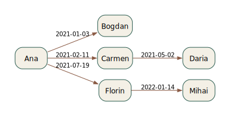
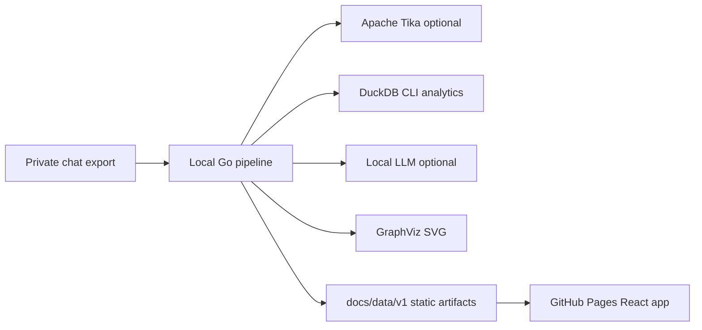

# Group Chat Archaeologist


Live site: https://baditaflorin.github.io/group-chat-archaeologist/

Repository: https://github.com/baditaflorin/group-chat-archaeologist

Support: https://www.paypal.com/paypalme/florinbadita

Group Chat Archaeologist turns long-running group chat exports into a topic timeline, who-introduced-whom graph, inside-joke origin tracer, and member-departure analysis. The public app is static; private chat processing happens locally.



## Quickstart

```bash
git clone https://github.com/baditaflorin/group-chat-archaeologist.git
cd group-chat-archaeologist
npm --prefix web install
make data
make build
make pages-preview
```

## Use Your Own Export

```bash
make data INPUT_PATH=/path/to/group-chat-export.txt
make build
make pages-preview
```

Text, JSON, CSV, TSV, Markdown, and log-like exports are read directly. Binary document formats can be extracted through Apache Tika by setting `TIKA_SERVER_URL` or passing `--tika_url`.

Optional local topic-label enrichment uses an Ollama-compatible endpoint:

```bash
OLLAMA_URL=http://localhost:11434 OLLAMA_MODEL=llama3.2 make data INPUT_PATH=/path/to/export.txt
```

## What It Builds

- Topic timeline across the archive.
- Who-introduced-whom GraphViz map.
- Inside-joke origin tracer based on repeated phrases and first sightings.
- Member-departure analysis based on last activity and archive end date.
- Static artifact metadata with schema version, input checksum, generation time, analytics engine, version, and commit.

## Architecture



Architecture docs: https://github.com/baditaflorin/group-chat-archaeologist/blob/main/docs/architecture.md

ADRs: https://github.com/baditaflorin/group-chat-archaeologist/tree/main/docs/adr

Data contract: https://github.com/baditaflorin/group-chat-archaeologist/blob/main/docs/data.md

Deploy guide: https://github.com/baditaflorin/group-chat-archaeologist/blob/main/docs/deploy.md

Privacy note: https://github.com/baditaflorin/group-chat-archaeologist/blob/main/docs/privacy.md

## Local Checks

```bash
make install-hooks
make test
make lint
make build
make smoke
```

No GitHub Actions are used. Local hooks run formatting, linting, type checks, gitleaks, unit tests, Pages build validation, and a Playwright smoke test.

## Requirements

- Go 1.24+
- Node.js 22+
- DuckDB CLI for the preferred analytics path
- GraphViz `dot`
- Apache Tika server for binary exports
- Ollama or compatible local LLM only if enrichment is desired

## License

MIT
