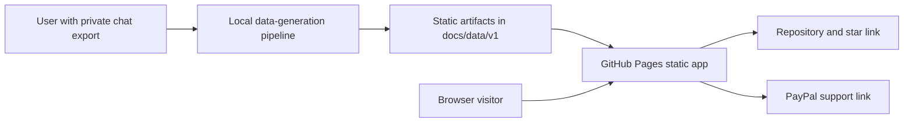
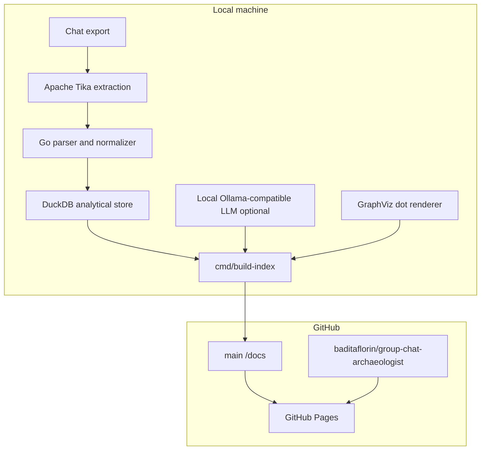

# Architecture

Live site: https://baditaflorin.github.io/group-chat-archaeologist/

Repository: https://github.com/baditaflorin/group-chat-archaeologist

## Context

```mermaid
flowchart LR
  User["User with private chat export"] --> Local["Local data-generation pipeline"]
  Local --> Artifacts["Static artifacts in docs/data/v1"]
  Artifacts --> Pages["GitHub Pages static app"]
  Visitor["Browser visitor"] --> Pages
  Pages --> Repo["Repository and star link"]
  Pages --> PayPal["PayPal support link"]
```

## Container

```mermaid
flowchart TB
  subgraph Local["Local machine"]
    Export["Chat export"]
    Tika["Apache Tika extraction"]
    Parser["Go parser and normalizer"]
    DuckDB["DuckDB analytical store"]
    LLM["Local Ollama-compatible LLM optional"]
    GraphViz["GraphViz dot renderer"]
    Generator["cmd/build-index"]
  end

  subgraph GitHub["GitHub"]
    Repo["baditaflorin/group-chat-archaeologist"]
    Docs["main /docs"]
    Pages["GitHub Pages"]
  end

  Export --> Tika --> Parser --> DuckDB --> Generator
  LLM --> Generator
  GraphViz --> Generator
  Generator --> Docs --> Pages
  Repo --> Pages
```
